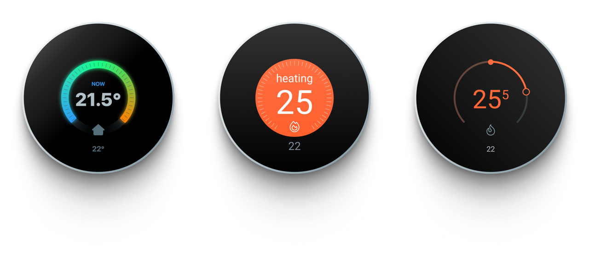
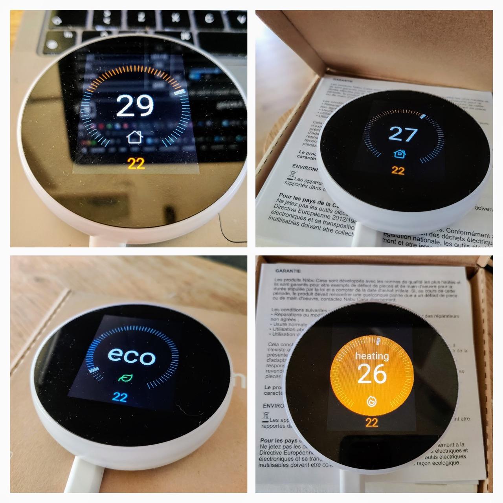
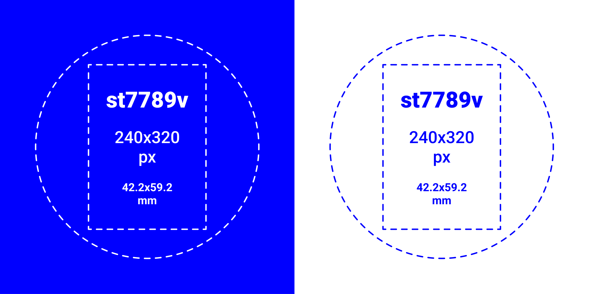

<link rel="stylesheet" href="https://veli.ee/esphome/style.css">

## Nest 🔥 Thermostat ❄️ clone on a Rotary Display running 

 
	<h3> 👉 <a href="https://community.home-assistant.io/t/esphome-nest-thermostat-clone-on-cheap-rotary-display/">Home-assistant community thread for discussion</a> 👈</h3>

## Installation

You can use the button below to install the pre-built firmware directly to your device via USB from the browser.

<esp-web-install-button manifest="./manifest.json"></esp-web-install-button>

## Fun features
* 🛜 Show a QR code if it’s not connected to wifi
	- 📲 Show another QR code to add it to HA if not connected to API
* 🎚️ Climate state, temperature, current_temperature, etc
* 🌡 Icons, mapped to preset_mode and state
* Colored background like Nest if 🟠 heating, 🔵 cooling, text 🟢 ECO if in eco preset_mode, etc

## Skin choices
### Nest

### Apple Home

### Google Home (App)

## Technical details

_________________

> 💖 If you find this useful, you can [&color=rgba(234,74,170,0.5) "for jsut 1 doolar you can lead a por man to fish")](https://github.com/sponsors/velijv)  
>  🤝 you can also send me more **ESP-based** or **Tuya** devices you want to see ported to ESPHome

###### All product names, logos, and brands are property of their respective owners. All company, product and service names used are for identification purposes only. Use of these names, logos, and brands does not imply endorsement.

